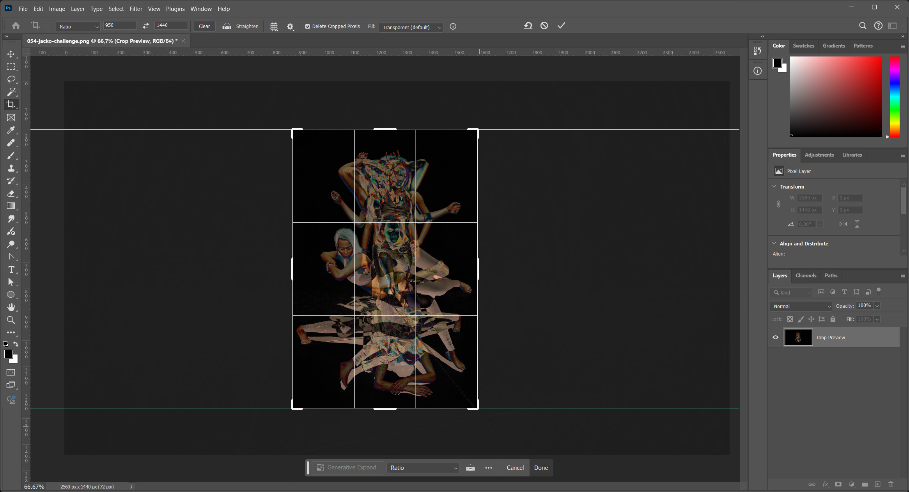

# Pose pack editing

## Introduction

As help with selecting poses for screenshots, a number of pose pack
screenshots are available. These can be found under the `/docs/Poses`
folder in the repository.

##  Editing and adding packs

1. Create screenshots of the poses, from first to last.
2. Write down the names of the poses.
3. Copy the screenshots to the `/docs/Poses/{pose-pack-name}` folder.
4. Register the pack in the `/docs/Poses/pose-packs.json` file.
5. Using a local webserver, use the UI under `/ui` to label and tag the images.

## Cropping and labeling images

The pose reference images are generated using the original screenshots,
cropped according to the `cutX`, `cutY` and `cutHeight` values in the 
pose pack configuration, using the predefined ratio of `950:1440`.
Since most poses are upright, this portait format works quite well.

1. Determine the `cutX`, `cutY` and `cutHeight` values for the pose pack.
2. Add the values in the `pose-packs.json` file.
3. Open the command line.
4. Run `cpmdb.php mod-pack="pose-pack-name" crop-images`.

### Determining the optimal crop size

To determine the best cropping values, open a set of the most extreme 
poses (in width and height) in an image editor. As an example, here's
a screenshot of Photoshop where I set up a crop mask using the right
ratio. I used the handy "exclusion" layer blending mode to see the 
maximum bounds of the poses.

I then used the guides to read off the `cutX` (pixels from the left), 
`cutY` (pixels from the top) and `cutHeight` (pixel height of the crop size).

## Generating the reference posters

The cropped images are used to generate the reference images listed in the
Markdown pose pack reference. With five images per row, these posters are a
good compromise between size and detail.

1. Open the command line.
2. Run `cpmdb.php generate-posters`.

## Generating the reference Markdown

The cropped images are used to generate the reference images listed in the
Markdown pose pack reference. With five images per row, these images are a
good compromise between size and detail.

1. Open the command line.
2. Run `cpmdb.php reference-doc`.

## Everything in one command

Provided that all the pose pack images have been labelled and tagged, 
the commands above can be combined into one:

1. Open the command line.
2. Run `cpmdb.php build-poses`.